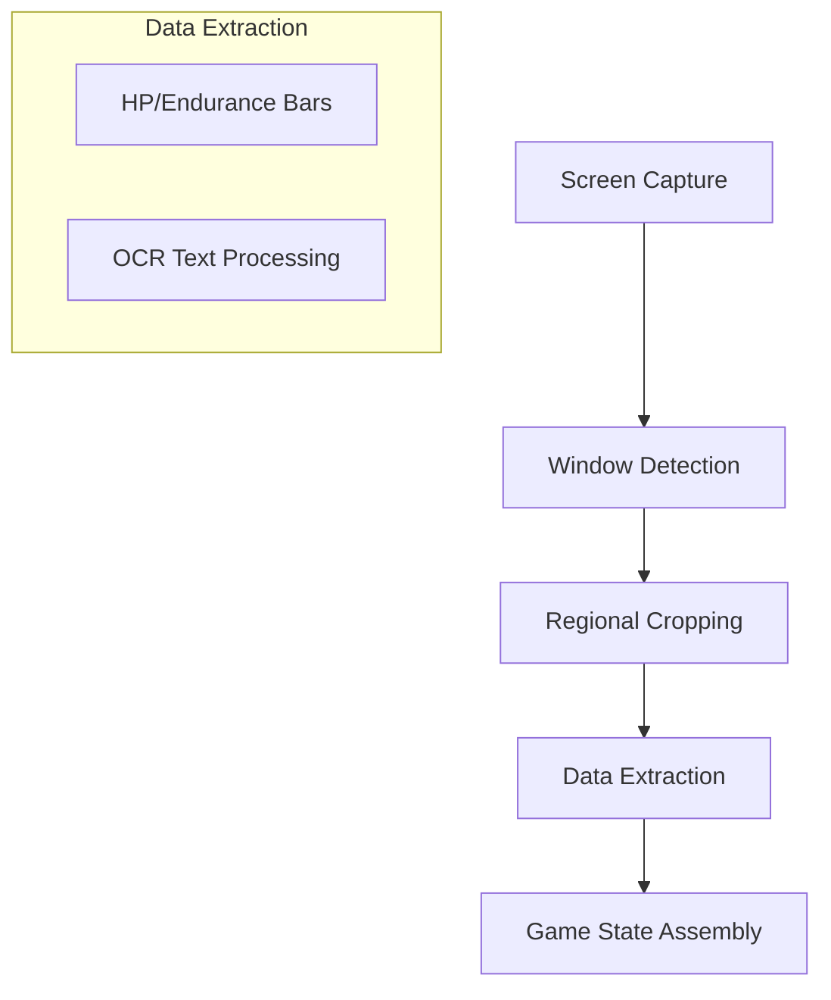

# Perception System Architecture

This document describes the high-level flow of how the City of Heroes bot processes screenshots to extract meaningful game state.

## Overview

The perception system is a pipeline that transforms raw pixels into a structured `GameState` object. It handles translucent UI elements, varied screen resolutions, and dynamic window placement.

## 1. Screen Capture (`ScreenReader`)
The `ScreenReader` uses the `mss` library to capture the entire game window. It manages the main capture loop and orchestrates the other components.

## 2. Window Detection (`WindowDetector`)
Because City of Heroes windows are translucent and movable, we use **Anchor-based Template Matching**:
- **Anchors**: We look for specific, unique corner pieces of the UI frames (e.g., the "pin" button or window corners).
- **Regional Priors**: To improve performance and accuracy, we restrict the search for the Target window to the top-left/center and the Player window to the top-right.
- **Translucency Handling**: Template matching is done with a threshold that allows for background noise.

## 3. Data Extraction (`DataExtractor`)
Once windows are located, we crop them and pass the regions to the `DataExtractor`.

### Bar Extraction (HP/Endurance)
- **Color Masking**: Uses HSV color ranges to isolate green/red (HP) and blue/purple (Endurance) bars.
- **Dependent Search**: The HP bar is located first. The Endurance bar is then searched for in a thin strip directly below the HP bar.
- **Container Detection**: The system scans for the blue UI frame borders to determine the "full" width of the bar container, allowing for accurate percentage calculation even at low health.

### Text Recognition (OCR)
- **Pre-processing**: To handle the stylized game font and translucent background, we:
    1. Upscale the image (2x-3x).
    2. Convert to grayscale.
    3. Apply Gaussian blur to denoise.
    4. Apply Adaptive Thresholding (Otsu) to produce a clean binary image.
- **Tesseract**: Uses `pytesseract` to extract names, levels, and super groups from the processed binary images.

## 4. Game State
The final output is a `GameState` dataclass containing:
- Player HP/Endurance %
- Target Type (Enemy, Player, NPC, None)
- Target Details (Name, Rank, Level, Archetype)
